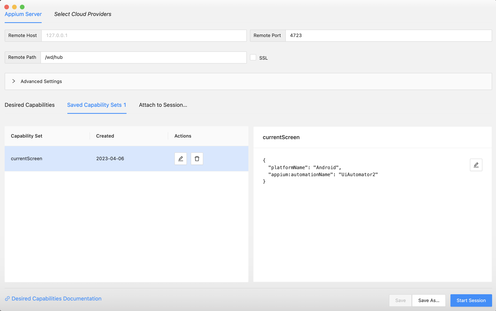

# appiumProject

## Prérequis
Je vais vous lister les prérequis nécessaires pour un projet Appium.

### Install Java JDK
- Pour commencer, vous devez installer Java JDK, qui est essentiel pour développer des tests avec Appium. Vous pouvez télécharger la dernière version sur [ce lien](http://www.oracle.com/technetwork/java/javase/downloads/jdk8-downloads-2133151.html).

### Install Android Studio
- Android Studio est l'environnement de développement recommandé pour créer des applications Android et travailler avec Appium. Vous pouvez télécharger Android Studio à partir de [ce lien](https://developer.android.com/studio/index.html).

### Install Visual Studio Code
- Visual Studio Code est un éditeur de code léger et puissant qui est couramment utilisé pour écrire des scripts de tests Appium. Vous pouvez le télécharger [ici](https://code.visualstudio.com/).

### Install Xcode
- Si vous prévoyez de développer pour des appareils iOS, vous devrez installer Xcode, l'IDE officiel d'Apple. Vous pouvez obtenir Xcode en suivant [ce lien](https://developer.apple.com/xcode/).

### Install Node.js & NPM
- Node.js est une plateforme JavaScript essentielle pour exécuter Appium. Vous pouvez télécharger la dernière version de Node.js sur [ce lien](https://nodejs.org/fr/download).

## Appium install

### Install appium-doctor
- [Appium Doctor](https://github.com/appium/appium-doctor) est un outil indispensable pour diagnostiquer et corriger les problèmes courants de configuration de Node, iOS et Android avant de démarrer avec Appium. Vous pouvez installer Appium Doctor en exécutant la commande suivante : `npm install appium-doctor -g`.

Vous l'exécutez pour vérifier les configurations de votre machine locale. Voir un exemple de sortie ci-dessous:

```bash
appium-doctor

info AppiumDoctor Appium Doctor v.1.4.3
info AppiumDoctor ### Diagnostic starting ###
info AppiumDoctor  ✔ The Node.js binary was found at: /Users/rijawilliamralitera/.nvm/versions/node/v8.9.1/bin/node
info AppiumDoctor  ✔ Node version is 8.9.1
info AppiumDoctor  ✔ Xcode is installed at: /Applications/Xcode.app/Contents/Developer
info AppiumDoctor  ✔ Xcode Command Line Tools are installed.
info AppiumDoctor  ✔ DevToolsSecurity is enabled.
info AppiumDoctor  ✔ The Authorization DB is set up properly.
info AppiumDoctor  ✔ Carthage was found at: /usr/local/bin/carthage
info AppiumDoctor  ✔ HOME is set to: /Users/rijawilliamralitera
info AppiumDoctor  ✔ ANDROID_HOME is set to: /Users/rijawilliamralitera/Library/Android/sdk
info AppiumDoctor  ✔ JAVA_HOME is set to: /Library/Java/JavaVirtualMachines/jdk1.8.0_152.jdk/Contents/Home
info AppiumDoctor  ✔ adb exists at: /Users/rijawilliamralitera/Library/Android/sdk/platform-tools/adb
info AppiumDoctor  ✔ android exists at: /Users/rijawilliamralitera/Library/Android/sdk/tools/android
info AppiumDoctor  ✔ emulator exists at: /Users/rijawilliamralitera/Library/Android/sdk/tools/emulator
info AppiumDoctor  ✔ Bin directory of $JAVA_HOME is set
info AppiumDoctor ### Diagnostic completed, no fix needed. ###
info AppiumDoctor
info AppiumDoctor Everything looks good, bye!
info AppiumDoctor
```

Si appium-doctor le peut, il fixera les problèmes pour vous, sinon, réglez-les manuellement. Si vous avez des problèmes avec ENV, assurez-vous que vous les avez configurés comme ceci:

```bash
export ANDROID_HOME=/Users/rijawilliamralitera/Library/Android/sdk
export JAVA_HOME=$(/usr/libexec/java_home)
export PATH=$PATH:$ANDROID_HOME/platform-tools:$ANDROID_HOME/tools:$ANDROID_HOME/platform-tools/adb:$ANDROID_HOME/build-tools:$JAVA_HOME/bin
# Celui-ci est utilisé pour le script `start.android.emulator`.
export emulator=/Users/rijawilliamralitera/Library/Android/sdk/emulator
```

### Install appium et ses drivers
- [Appium](https://github.com/appium/appium) est le framework d'automatisation mobile lui-même. Vous pouvez l'installer en exécutant la commande suivante : `npm install appium -g`. Assurez-vous également d'installer les drivers nécessaires pour Android et iOS en utilisant les commandes fournies:
- Pour le driver Android => `appium driver install uiautomator2`
- Pour le driver iOS => `appium driver install xcuitest`

Si l'installation de npm a réussi, vous devriez pouvoir lancer la commande `appium -v` et voir une version comme ci-dessous.

```bash
➜  appium -v
2.1.3
➜
```

> Il faut toujours vérifier sur le site d'Appium s'il y a une nouvelle version. Les nouvelles versions d'Appium sont généralement publiées lorsque Android/iOS sortent de nouvelles versions.
Des corrections de bugs peuvent également être publiées. Il suffit de consulter le [changelog] (https://github.com/appium/appium/blob/master/CHANGELOG.md) pour avoir une vue d'ensemble claire.

### Install appium-desktop

- [Appium Desktop](https://github.com/appium/appium-desktop/releases) est une application open source qui vous permet d'utiliser le serveur Appium avec une interface utilisateur conviviale. Il faut installer la dernière version stable sur votre machine.

Voir le [readme](https://github.com/appium/appium-desktop) pour savoir comment utiliser l'Appium Desktop.

> :warning: **Appium Desktop n'est plus maintenu** et présente des failles de sécurité connues. Il est conseillé de ne pas l'utiliser du tout. Utilisez-le en local si vous voulez mais c'est à vos risques et périls. La méthode recommander est de lancer appium en ligne de commande:

```bash
➜  appium --base-path=/wd/hub
[Appium] Welcome to Appium v2.1.3
[Appium] Non-default server args:
[Appium] {
[Appium]   basePath: '/wd/hub'
[Appium] }
[Appium] Attempting to load driver uiautomator2...
```

- Il ne faut pas oublier le paramètre de lancement **base-path=/wd/hub** car la configuration a changé depuis la [migration Appium 2.X](https://appium.io/docs/en/2.1/guides/migrating-1-to-2/)

### Install appium-inspector
- [Appium Inspector](https://github.com/appium/appium-inspector/releases) est un outil d'interface graphique qui permet d'inspecter les éléments des applications mobiles. Il faut installer la dernière version stable sur votre machine.

Il fonctionne avec un serveur Appium. Lorsque vous l'utilisez pour inspecter une application mobile :
- Il faut démarrer le serveur appium soit en **ligne de commande** ci-dessus, soit en passant par **appium-desktop**
- Il faut démarrer un device Android ou iOS (réel ou emulé)
- Il faut une configuration minimum pour pouvoir se connecter et inspécter le device
